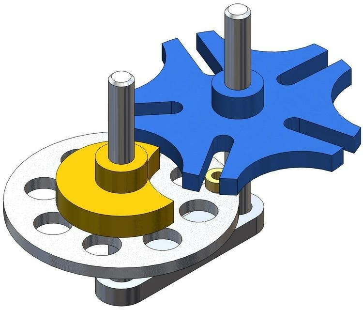

# Индивидуальный проэкт

## Идеи

**1.** 3D модель механизмов

**2.** 3D модель квартиры прошлого 80-90 годов

**3.** Робот который будет выполнять различные функции, такие как: 

            1) подставлять цифры в формулы и считать их значение

$$
x^{17}=\frac{x+y^{278}}{\sqrt{x+{1}{x}}}
$$

            2) подбирать все возможные варианты ответов на заданный вопрос

*Также индивидуальный проэкт можно делать не только однгой, но и с другим человеком*